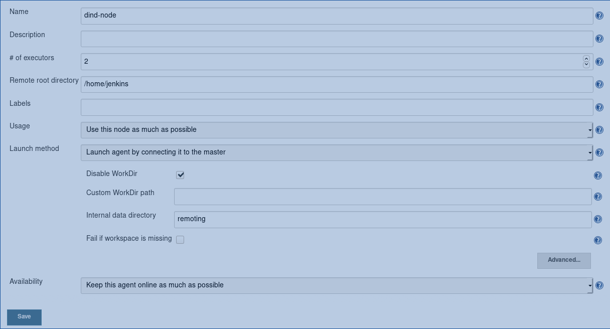
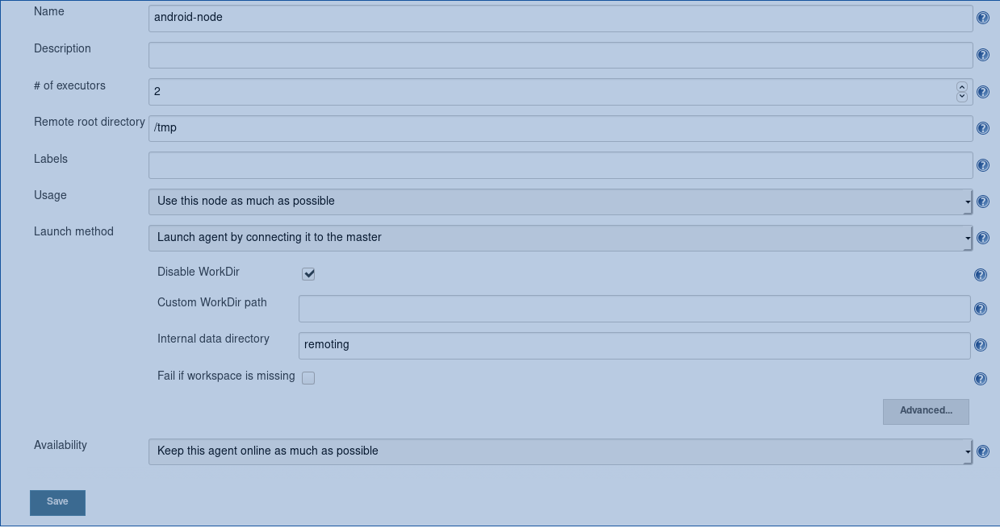

# Jenkins
Este repositório contém os artefatos necessários para subir meu ambiente de integração contínua.  
Utilizo nodes do jenkins, sendo os nodes imagens docker para necessitar instalação de ferramentas dentro do jenkins.

## Nodes
Atualmente são 2 os slaves:
- jenkins-slave-dind  
Slave docker-in-docker para execução de comandos docker nos pipelines  
- jenkins-slave-android  
Slave com android-sdk para construção das aplicações android

Para configurar os nodes vá em **Manage Jenkins/Manage Nodes**
- Docker-in-docker slave

- Android slave


## Credenciais
### github
A credencial do github utiliza o id **github**, é utilizada para baixar os fontes das aplicações e é do tipo **Username with Password**

### certificado
A credential **signingPassSecret** é utilizada para obter as senhas dos certificados para assinar as aplicações Android e é do tipo **Secret text**

## Subindo a aplicação
### Jenkins
Para subir o jenkins é preciso clonar este repositório e executar o comando
```
docker-compose up -d jenkins
```
### Nodes
Para subir os nodes, execute o comando abaixo:
- dind
```
docker-compose up -d jenkins-slave-dind
```
- android
```
docker-compose up -d jenkins-slave-android
```
Não é necessário subir todos os slaves, podem ser iniciados conforme a necessidade.  

*Algumas variáveis de ambiente estão hardcoded no docker-compose.yml e precisam ser revisadas, inclusive é preciso configurar o node dentro do jenkins para obter o slave-secret*
